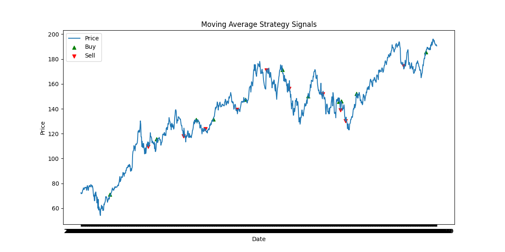
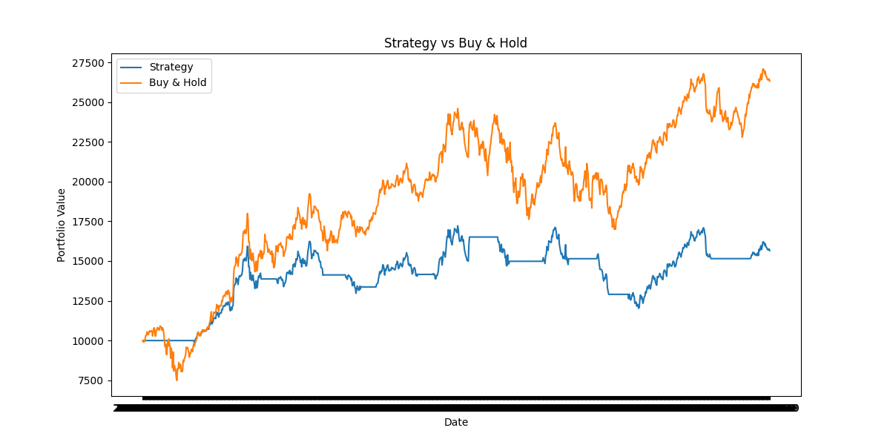

# Vectorized Trading Strategy Backtesting Engine

A Python project for evaluating trading strategies using historical market data.

## Strategy Signals

Buy and sell signals generated by a moving average crossover strategy.

## Strategy Performance

Comparison between the strategy and a buy-and-hold benchmark.

## Features

- Moving average crossover strategy
- Vectorized backtesting using Pandas
- Portfolio performance metrics
- Strategy vs Buy-and-Hold comparison

## Tech Stack

Python  
Pandas  
NumPy  
Matplotlib